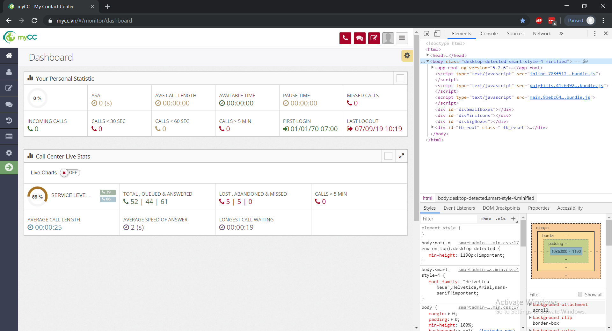
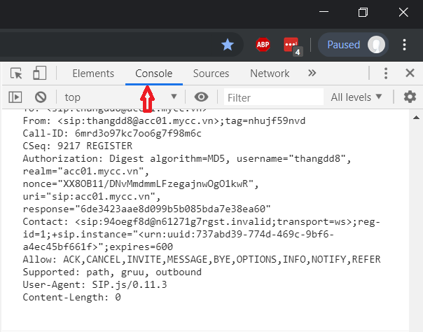
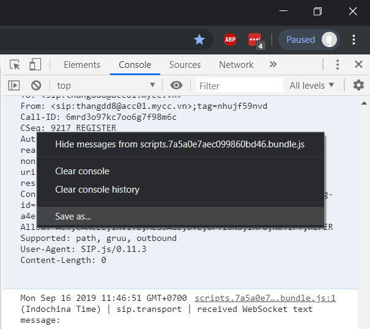

*************************************************
Thu thập log của trình duyệt (chrome console log)
*************************************************

.. meta::
   :description lang=en: Get started writing technical documentation with Sphinx and publishing to Read the Docs.

.. _extensions: http://www.sphinx-doc.org/en/master/ext/builtins.html#builtin-sphinx-extensions

Tại sao và khi nào chúng tôi cần thu thập console log 
#####################################################

Trong một số trường hợp có vấn đề phát sinh với webphone của bạn, chúng tôi sẽ cần bạn thu thập log (console log) của trình duyệt để từ đó xác định và khắc phục vấn đề.

Các vấn đề chúng tôi tới console log để xác định lỗi:

* Agent không thể tiếp nhận cuộc gọi đang Ring tới
* ...

Các bước lấy console log của trình duyệt:

* Ngay khi đang bị vấn đề phát sinh với MyCC Webphone (ví dụ: không thể click vào nút trả lời cuộc gọi đang Ring tới). 
* Không thực hiện bất cứ thao tác nào khác mà cần ngay lập tức ấn F12 để mở DevTools
* Thực hiện các bước như dưới đây để lưu log

Các bước lấy console log 
########################

Open Chrome DevTools
********************

At the main screen of MyCC, press F12 to open Chrome DevTools. After DevTools opened, you will see something like below:

Chú ý: Có thể có trường hợp DevTools là một cửa sổ riêng biệt với màn hình chính của MyCC.
	
Click the Console tab and then save console log
***********************************************

With DevTools, click the Console tab of DevTools

Inside Console tab, right-click to open a context menu, select Save as...

Select location for log file and Please then send MyCC Team the log you gathered.