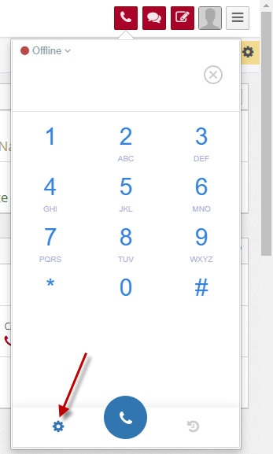
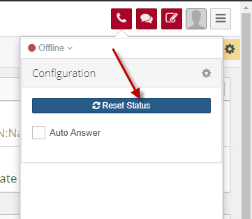

***********************************************
Reset status when you cannot change your status
***********************************************

.. meta::
   :description lang=en: Get started writing technical documentation with Sphinx and publishing to Read the Docs.

.. _extensions: http://www.sphinx-doc.org/en/master/ext/builtins.html#builtin-sphinx-extensions

When you cannot change your status and  cannot receive inbound call, please follow these steps:

* Press Ctrl + F5 your browser. Open your webphone, change status to Available
* If cannot please click Settings icon, click Reset button and wait some seconds, your Voice status will be changed to AVAILABLE (or ONLINE) and can receive inbound call

