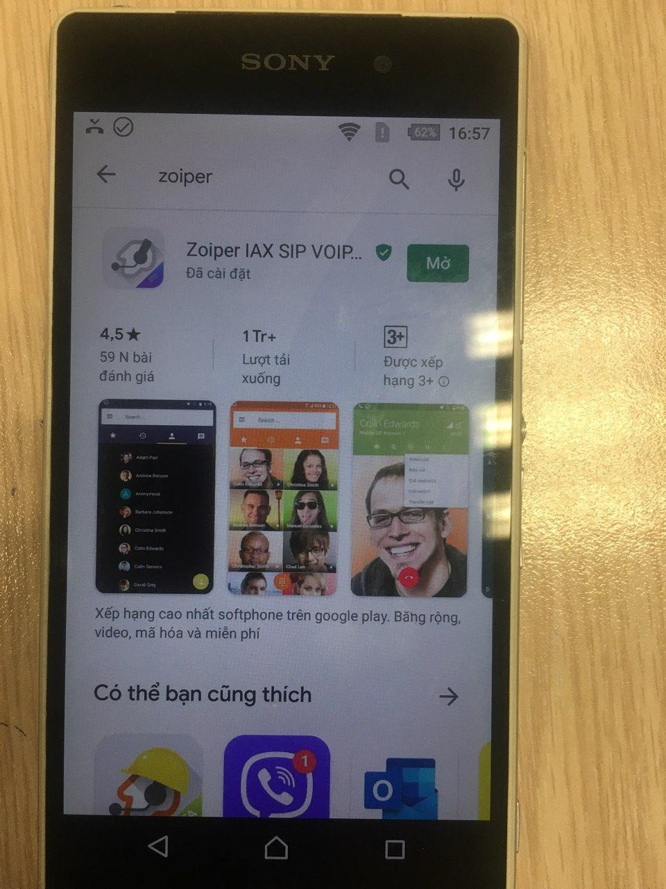
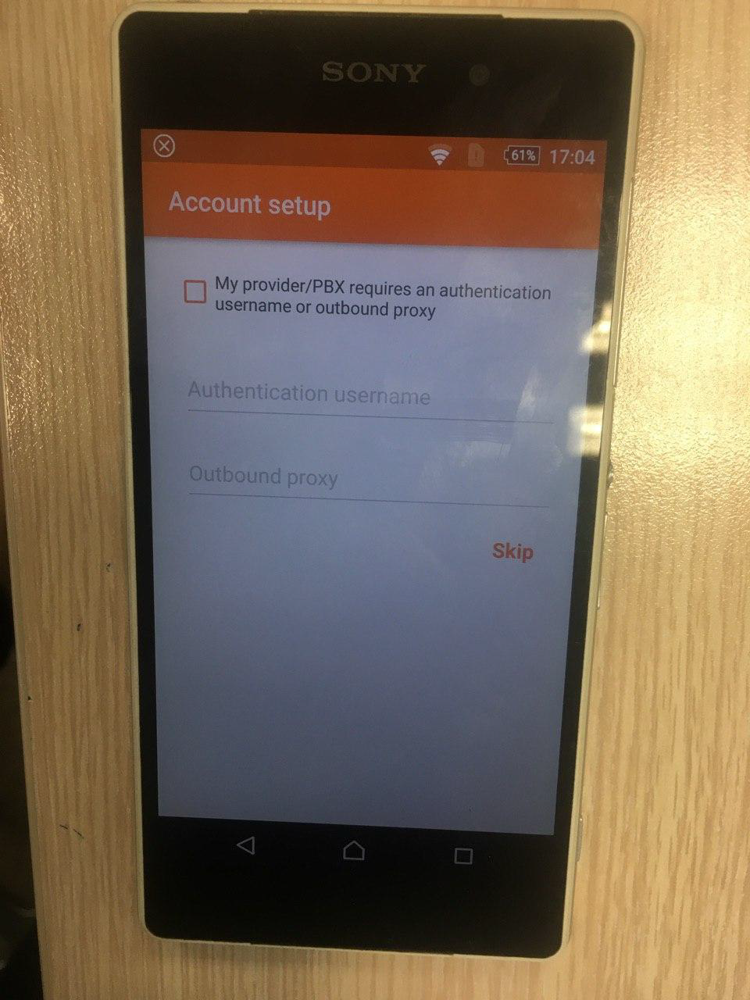
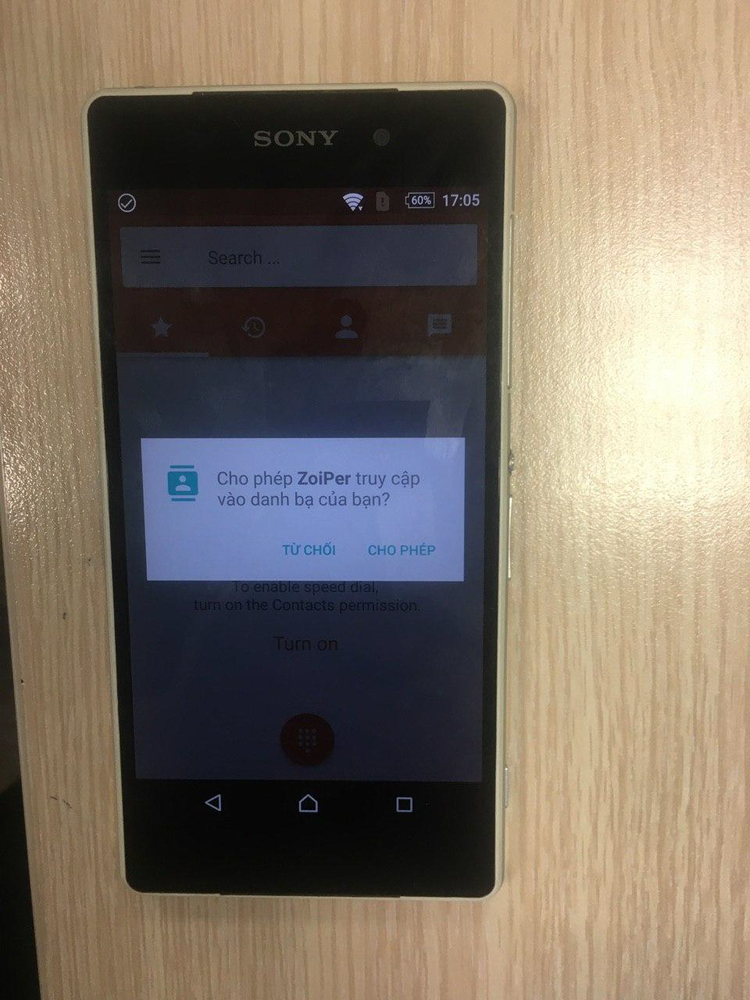

*******************************
Use Mobile APP to receive calls
*******************************

.. meta::
   :description lang=en: Get started writing technical documentation with Sphinx and publishing to Read the Docs.

.. _extensions: http://www.sphinx-doc.org/en/master/ext/builtins.html#builtin-sphinx-extensions

SETTING FOR AGENT'S DEVICE
##########################

* Administrator of the system need to do Change settings : ``Settings/ Call settings/ Endpoint devices``
* Search with username of agent => open View detail. 

Do change: 

* Unchecked on checkbox: ``Used  for webphone  (WebRTC)``
* pass: 123456
* Click Save

ZOIPER WITH ADROID PHONE
########################

1.	Search Zoiper on CH Play 
****************************

2.	install this app on your phone and then open it
***************************************************

Click Agree and Continue

3.	Enter information: Example: 5 accounts 
******************************************
	

* mobile1@myccpublic.bitel.com.pe:5061
* mobile2@myccpublic.bitel.com.pe:5061
* mobile3@myccpublic.bitel.com.pe:5061
* mobile4@myccpublic.bitel.com.pe:5061
* mobile5@myccpublic.bitel.com.pe:5061

* pass: 123456

Then Click Create an account

4. SETUP STEP 1
***************

Input: myccpublic.bitel.com.pe 

5. SETUP STEP 2
***************

Click SKIP

6. SETUP STEP 3
***************

Choose SIP TCP , wait until it shows: Finish  => click Finish 

.. figure:: ../_static/images/zoiper/android/account_setup_4.png
    :align: center
    :figwidth: 600px
    :target: ../_static/images/zoiper/android/account_setup_4.png

7.	Allow this app to access your Call Manager, Your contact, ...
*****************************************************************

* Click OK. 
.. figure:: ../_static/images/zoiper/android/permission_4.png
    :align: center
    :figwidth: 600px
    :target: ../_static/images/zoiper/android/permission_4.png

8.	Click Turn On 
*****************
	

9.	Menu icon 
*************

10.	Your APP is ready
*********************

.. figure:: ../_static/images/zoiper/android/done_3.png
    :align: center
    :figwidth: 600px
    :target: ../_static/images/zoiper/android/done_3.png

11.	Press 9999 and Call 
***********************

	
You will hear a message:  You already login to queue successfully. 